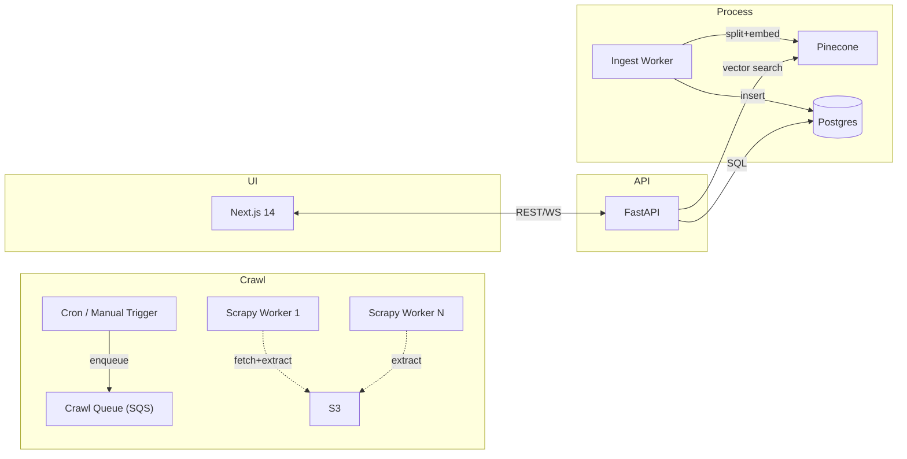

# GrandGuruAI – Project Planning

> **Last updated:** 2025‑04‑24

---

## 1  Vision & Scope

GrandGuruAI will become a **one‑stop, AI‑powered knowledge and planning assistant** for network‑/telecom‑centric projects. It continuously crawls any vendor domain (user‑defined), extracts products, prices and documentation, embeds the content for semantic search, and exposes an API & web UI that can:

- answer technical questions (RAG),
- recommend BOMs / architectures within budget, and
- output step‑by‑step deployment plans.

---

## 2  Tech‑Stack Decisions

| Layer                     | Choice                                                               | Rationale                                                        |
| ------------------------- | -------------------------------------------------------------------- | ---------------------------------------------------------------- |
| **Crawler Core**          | **Python + Scrapy**                                                  | battle‑tested async fetcher, extensible middle‑ware              |
| **Extractor Plug‑ins**    | Python classes + optional CSS/XPath rules in DB                      | domain‑specific, hot‑swappable                                   |
| **Processing / AI**       | **LangChain loaders & splitters**  +  **Pydantic AI agents**         | leverage LangChain ecosystem; get type‑safe, IDE‑friendly agents |
| **LLM Provider**          | OpenAI GPT‑4 / GPT‑3.5 (pluggable)                                   | best accuracy today; can swap via LangChain                      |
| **Vector DB**             | **Pinecone** (dev) → Weaviate/Qdrant optional                        | managed, fast, filterable                                        |
| **Structured DB**         | **PostgreSQL (Neon in dev, RDS prod)**                               | relational graph via FKs; SQL access for agents                  |
| **API Service**           | **FastAPI** + SQLAlchemy, Pydantic models                            | async, OpenAPI auto‑doc                                          |
| **Front‑end**             | **Next.js 14 (App Router)**, TS, Tailwind, shadcn/ui, TanStack Query | Cursor‑friendly DX, SSR, easy fetch hooks                        |
| **Containerisation / CI** | Docker → GitHub Actions → AWS Fargate (prod)                         | reproducible, cloud‑ready                                        |

---

## 3  High‑Level Architecture

---

## 4  Module Boundaries

| Package       | Key Contents                                          |
| ------------- | ----------------------------------------------------- |
| `crawler/`    | Scrapy settings, spiders, `extractors/` plug‑ins      |
| `processors/` | `ingest_worker.py`, LLM summarizer, embedding helpers |
| `api/`        | FastAPI app, route modules, auth, websocket logs      |
| `web/`        | Next.js project (pages, hooks, components)            |
| `shared/`     | Pydantic models, OpenAPI TS client, utils             |

---

## 5  Data Model (Postgres)

- **products** (id, brand, model, name, category, price, created\_at …)
- **documents** (id, product\_id FK, doc\_type, file\_path, summary, created\_at)
- **videos** (id, product\_id FK, youtube\_id, transcript\_path, summary)
- **crawlers** (id, target\_url, type, status, queued\_at, …)
- **data\_sources**, **extraction\_rules** (config from earlier prototype)

Vector records stored in Pinecone with metadata `{"product_id":123,"chunk_id":2}`.

---

## 6  Coding Conventions

- Follow **Global Rules** (file lengths, tests, PEP 8, Black, 80 % coverage).
- Python 3.11, Poetry, `src/` layout, relative imports.
- Front‑end uses strict TypeScript, ESLint, Prettier.

---

## 7  Milestones

| Sprint | Goal                                              | ETA     |
| ------ | ------------------------------------------------- | ------- |
| **0**  | Env & scaffolds compile/tests green               | 1 day   |
| **1**  | Base crawler + Grandstream extractor outputs JSON | +3 days |
| **2**  | Ingest pipeline writes to Postgres & Pinecone     | +4 days |
| **3**  | API + Next.js dashboard list products & run crawl | +4 days |
| **4**  | Pydantic‑AI recommendation agent                  | +5 days |

Further sprints: auth, multi‑tenant, pricing calculators, deployment templates.

---

## 8  Environment Setup (dev)

1. `pyenv local 3.11.8 && poetry install`
2. `docker compose up -d pg` (or Neon URL in .env)
3. `docker compose up -d pinecone` (if using local Qdrant)
4. `cd web && pnpm i && pnpm dev`

---

## 9  Open Questions

- Which cloud (AWS vs GCP) for first deploy?
- Do we embed YouTube audio or use captions only?
- Pricing API access limits? (OpenAI tier)

Update this doc when decisions are made or architecture shifts.

